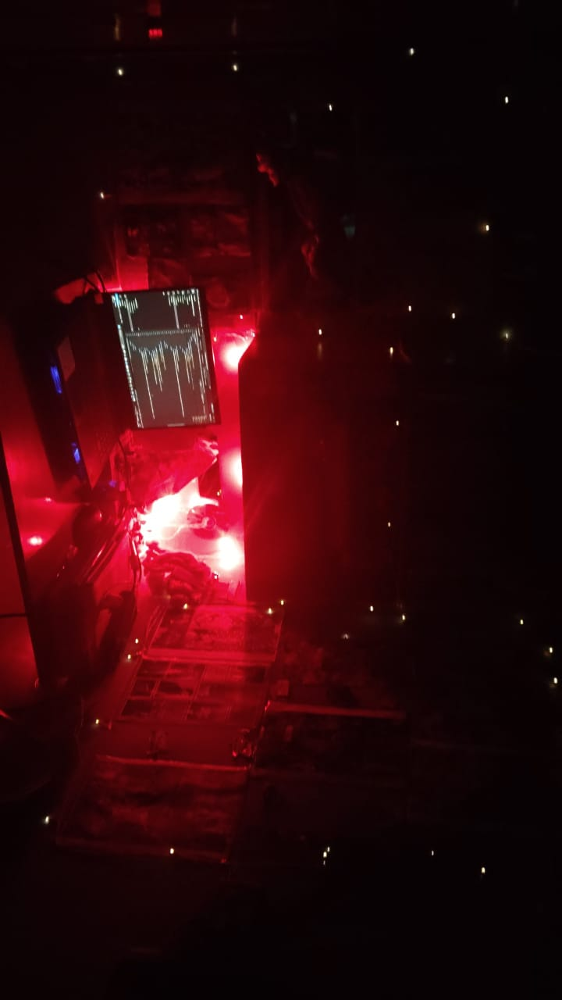

# Lime For Snake - A Digital Sanctuary

> A digital sanctuary and personal blog for Lime For Snake, built with vanilla HTML, CSS, and JavaScript.

Welcome to the source code for my personal website, a tiny digital laboratory where I get to experiment with code and share my verse. This site serves as a living portfolio for my writings, from technical blog posts to personal poetry.

**Check it out live!** -> [https://saurav250.github.io/blog.limeforsnake/](https://saurav250.github.io/blog.limeforsnake/)



## About This Project

This website is my corner of the internet. It's a space where my two passions, coding and writing, come together. By day, I'm a student and developer, but I'm a writer in every breath. This project is my attempt to build something beautiful out of the void, using both lines of code and lines of verse.

The goal was to create a site that not only functions as a portfolio but also has a distinct personality—a "goofy ahh vibe," if you will. It's my digital attic, my public journal, and a place for my thoughts to live.

## ✨ Key Features

*   **Distinctive Theming**: A custom "Vintage Wine & Rose Gold" color palette creates a warm, unique, and slightly moody atmosphere.
*   **Interactive UI**: The site is full of small interactions, including card hover effects, glowing text, and image overlays to create a more engaging experience.
*   **Animated Mouse Trail**: A custom JavaScript-powered star trail follows the user's cursor, adding a touch of magic.
*   **Fully Responsive**: Designed to look great on desktops, tablets, and phones.
*   **Dedicated Content Sections**: Separate, beautifully styled pages for my **Poetry** archive and **Blog** musings.
*   **Smooth Scrolling**: Navigation links smoothly animate the scroll to the corresponding section.

## 🛠️ Built With

This is a pure, lightweight static website built with foundational web technologies. No heavy frameworks, just the essentials.

*   **HTML5**: For the core structure and content.
*   **CSS3**: For all the custom styling, layouts (including Flexbox and Grid), animations, and responsive design.
*   **Vanilla JavaScript**: For interactive elements like the mouse trail effect.

## 🚀 Getting Started

To run this project locally, simply clone the repository and open the `index.html` file in your favorite web browser.

```bash
# Clone this repository
git clone https://github.com/saurav250/blog.limeforsnake.git

# Navigate to the project directory
cd blog.limeforsnake

# Open index.html in your browser
```

## 👤 Author

**Lime For Snake**

*   **GitHub**: @saurav250
*   **LinkedIn**: Saurav Garg
*   **X (Twitter)**: @LimeForSnake
*   **Instagram**: @lime_for_snake

---

This project was a blast to build. Feel free to explore the code, get inspired, or even drop a line!